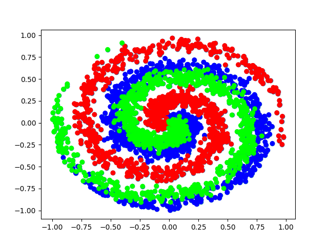
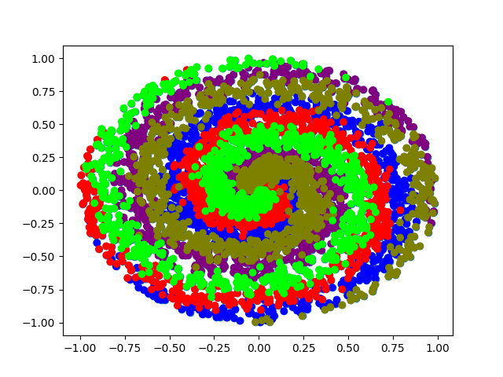
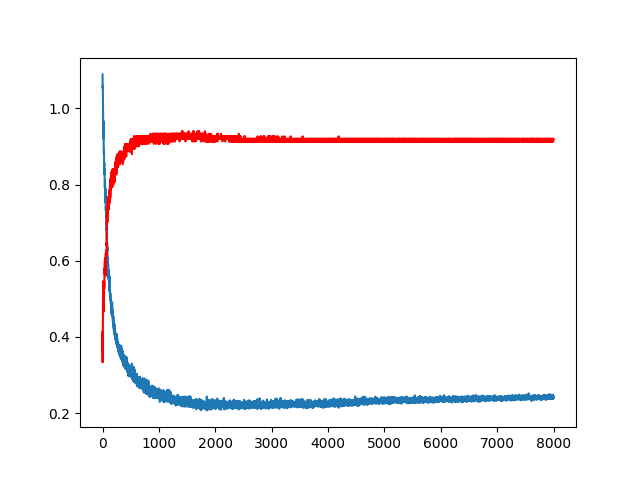

# Spiral Branch Determiner Project
The purpose of this project is to build a neural network from scratch to determine what branch of a spiral function in a cartesian plan, a given dot (x,y) is closest to.
In the beginning it will be provided a dataset with a set of dots and the number of the spiral branch the dot belongs to. As an example, give a look in the following images:

 - _Example of dataset with 3 spiral branches and 1000 dots._

- _Example of dataset with 5 spiral branches and 1000 dots._

## Usage

After download the source code, just hit the run button in your IDE to run the spiral.py file. We are takin inputs from the nnfs dataset, which is able to generate the spiral function and provide a
set of dots already assigned to each branch generated. The number of samples generated and the number of branches - or classes - can be modified in the spiral.py file.

After a few sets of training/testing the neural network model achieved an accuracy of nearly 94%.

- _Accuracy(red) and Loss (blue) taken after each epoch of training, calculated for the testing data._

This work was an implementation of the Neural Nertwork proposed by Harrison Kinsley & Daniel Kukieła, in their book "Neural Networks from Scratch in Python". I made
some changes and tried to write it in a more object-oriented, and simplified way. I also tried to make easier to read each function that the neural network uses in its 
learning process.

I am also making available my personal notes, which I wrote while I was studying the book. There you can check the Activation Function, the Input Format, 
and the Output Format we are using in this project. Besides, you can check the cost function and the chosen strategies applied to perform the Gradient Descent and the 
Backpropagation steps. I tried to summarize my studies about building a neural network from the scratch as much as possible. 

Feel free to reach me about any improvements.

## License

[MIT](https://choosealicense.com/licenses/mit/)
